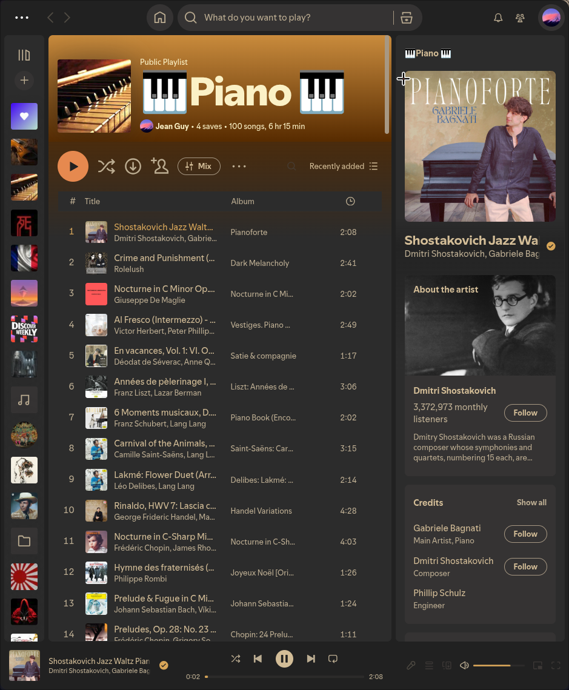
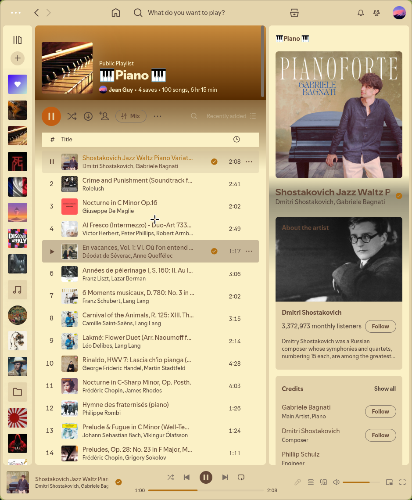

# Gruvbox Material for Spicetify

A [Spicetify](https://spicetify.app/) theme using [sainnhe's Gruvbox Material](https://github.com/sainnhe/gruvbox-material) palette.

   | Dark | Light |
   |----------|------|
   |  |  |

## Install

1. Copy the `gruvbox-material` folder into your Spicetify Themes directory:

   | Platform | Path |
   |----------|------|
   | Linux | `~/.config/spicetify/Themes/` |
   | macOS | `~/.config/spicetify/Themes/` |
   | Windows | `%appdata%\spicetify\Themes\` |

2. Apply:

```bash
spicetify config current_theme gruvbox-material
spicetify config color_scheme dark
spicetify apply
```

Switch with:
```bash
spicetify config color_scheme light
spicetify apply
```

## Credits

- Color palette: [gruvbox-material](https://github.com/sainnhe/gruvbox-material) by sainnhe
- Built for [Spicetify](https://spicetify.app/)

## License

MIT
